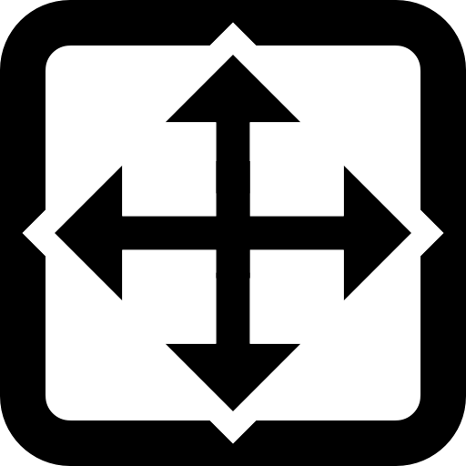

#  AffectTracker
## Real-time continuous rating of affective experience in immersive Virtual Reality

The **AffectTracker** is a tool which allows users to continuously track and record moment-by-moment ratings of valence and arousal (i.e., pleasantness and intensity of feelings) in Unity.

With the help of an VR input device, users indicate their affective state by positioning a cursor in the valence-arousal space of the affect grid and receive customizable real-time visual feedback.

## Description

The **AffectTracker** has been developed with Unity 2022.3.12 under OpenXR ([khronos.org/openxr/](https://www.khronos.org/openxr/)) and it is designed to work with the touchpad or joystick of a VR controller of any VR equipment supported by OpenXR.

The tool includes several customization options for researchers:
- visual user feedback (see below)
- haptic vibrations to remind users to rate continuously
- adjustable sampling frequency

### Visual feedback

The **AffectTracker** offers several visual feedback options which can be switched on and off independently: 

#### Grid: 
Visualize valence-arousal space with a simplified version of the affect grid: see the four quadrants, a round cursor, and no text. 
#### Flubber: 
Visualize an abstract shape, called “Flubber”, whose low-level visual features are mapped onto the dimensions of the affect grid.

 
The “Flubber” consists of three parts, which can be toggled on and off independently: the **base**, **outline**, and **halo**.

The **base** is the central circular body with radiating projections, while the **outline** and **halo** have been designed to make the base stand out against any background.   

Many of the visual features, as well as their mapping onto the cartesian (valence, arousal) and polar (distance, angle) coordinates of the affect grid, can be customized. The following table describes each customizable feature and indicates its default/recommended values:

| Feature | Min | Max | Range | Description|
|---|---|---|---|---|
|Projection Smoothness|0|1|0-1|angular, edgy, pointy, sharp (value: 0) VS. rounded, smooth, soft (value: 1) projections|
|Projection Amplitude|0.2|0.4|0-1|amplitude or height of the projections from the main body of the Flubber|
|Color|0|1|0-1|position in a pre-defined color (Base of Flubber) gradient|
|Saturation|0|1|0-1|proportional color saturation value (note: can go higher than 1)|
|Oscillation Frequency|0.5|2.5|0-90|frequency in Hz of projection oscillations|
|Projection Time Synchronization|0.8|0|0-1|degree of temporal de-synchronization of all projections (higher values are less synchronized; 0 is perfectly synchronized)|
|Projection Amplitude Difference|0.8|0|0-1|degree of asymmetry in the amplitudes of all projections (0 is perfectly symmetrical)|

The last two features control the degree of regularity in the oscillations of the Flubber (e.g., from chaotic/irregular to regular).   

Each feature needs a minimum and a maximum value as inputs. These correspond to extrema of the mapped coordinates (e.g., when a feature is mapped to the x-axis, `min` corresponds to the left-most side of the grid, while `max` corresponds to the right. Similarly, when mapped to the y-axis, `min` refers to the bottom and `max` to the top).

## Installation
Download the latest **AffectTracker.unitypackage** file from the [Releases](https://github.com/afourcade/AffectTracker/releases) section.

In your Unity project, go to `Assets` > `Import Package` > `Custom Package...` and select the **AffectTracker.unitypackage** file. This will open the Import Unity Package window. Make sure everything is selected, then click Import.

## Usage
The project contains three Demo scenes with the **AffectTracker** (found in the Hierarchy under **XR Origin** > **Camera Offset** > **Main Camera** > **AffectTracker**):
- DemoSceneClean: contains only the **AffectTracker**
- DemoSceneScifiEnvironment: contains the **AffectTracker** and a simple virtual environment
- DemoScene360Video: contains the **AffectTracker** and video player with a sample video

To add the **AffectTracker** to a scene, its **prefab** should be placed under the **Main Camera** in the Hierarchy as in screenshot below:

### Inspector
The **AffectTracker** can be customized directly in the Inspector. The following sections explain the parts which can be found there.

#### Transform
The position of the visual feedback in the environment can be set with the **Position** and **Rotation**.

> *Note: The default Position (x = 0, y = -0.4, z = 1.5, units: m) is center-bottom of the visual field.*

#### Visual Feedback
> *Settings for the visual feedback of the tool during rating*

The Visual Feedback component contains separate sections for **Flubber** and **Grid** settings.  

In the **Flubber Settings**, the different Flubber parts (Base, Outline, Halo) can be toggled on and off and the colors of each part can be customized.  

In the **Grid Settings**, the Grid's outer square, x and y axis lines and cursor can be toggled on/off.   
An outline (for the Grid and/or the cursor) is also available.  
The color of the Grid, cursor and their outlines can be customized.  
Finally the thickness of the Grid lines and outlines, as well as the size of the cursor can be changed.   

The **Scaling** slider controls the size of the Grid/Flubber. 
  
> *Note: If a uniform color is wanted for the Flubber Base, the Gradient should be set to a single solid color.*

#### Input Simulator
> *Simulate input from a VR controller for testing*
  

#### Input Reader
> *Settings for the VR controller used for the ratings*

**Use Haptic Device** determines which controller will be used for the ratings.  
  
> *Note: **Advanced settings** should only be changed if you know what you are doing* 🙂

#### Rating Logger
> *Settings for how ratings are recorded*

**Rating Type** determines which type of rating will be recorded. The options are:
- **CR**: continuous rating
- **SR**: single rating

**SR** will record a single rating when the trigger of the VR controller is pressed.  
**CR** will record continuously ratings at the frequency of **Sampling Frequency** (in Hz). 

**Auto Start** will make the logging of the ratings start on Scene start.

**Auto Save to Disk** allows CR ratings to be saved to disk in a .txt file (named **Filename**).
  
> *Note: The .txt file containg the CR ratings will be saved in the Unity **Application.DataPath**.*

> *Note: SR will be held in buffer memory.*

#### Affect Mapping
> *Settings to map the cartesian/polar coordinates of the affect grid to low-level visual features of the Flubber*

Each visual feature of the Flubber described above can be mapped to a coordinate axis, and the desired minimum and maximum values of that feature (the values which will be mapped to the ends of the chosen axis) can be set.

If you do not want to use one of the mapping, simply remove the feature from the Settings list.

> *Note: If you are using the Color mapping, set the Base gradient in Visual Feedback as wished. Please not that the gradient shouls have the same min and max values to avoid discontinuity when switching between 0 and 360.*

#### Controller Haptics
> *Settings to enable/disable vibrations of the VR controller. Can be used to remind the user to rate continuously (e.g., when there is no visual feedback)*

**Use Haptics** enable/disable vibrations.  
A pulse is sent every **Haptic Interval** (in seconds), with a duration of **Pulse Duration** (in seconds) and an intensity of **Pulse Strength** (a value between 0 and 1).   

## Support
If you encounter any trouble using the prefab, feel free to contact Antonin Fourcade (antonin.fourcade@maxplanckschools.de) for support.

## Roadmap
Other releases planned but not scheduled.

## Contributing
If you want to contribute or have any suggestions, please send an e-mail to antonin.fourcade@maxplanckschools.de.

## Authors and acknowledgment
Antonin Fourcade  
Francesca Malandrone  
Jeroen de Mooij (XR Developer)  
Anthony Ciston    
Lucy Roellecke  
Sara Carletto  
Michael Gaebler    

## License
[BSD-3](https://github.com/afourcade/AffectTracker#BSD-3-Clause-1-ov-file)

## Project status
Development has slowed down for the moment.
